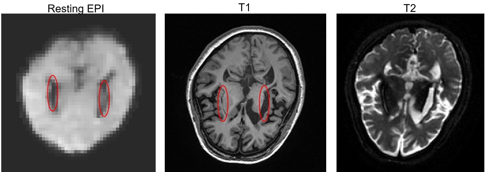
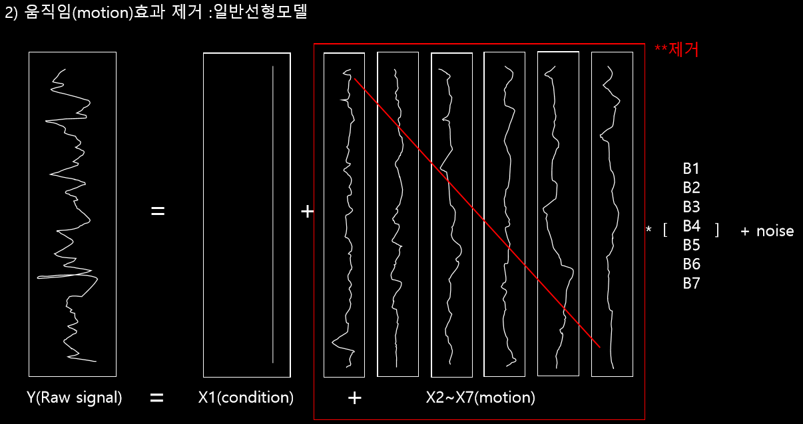
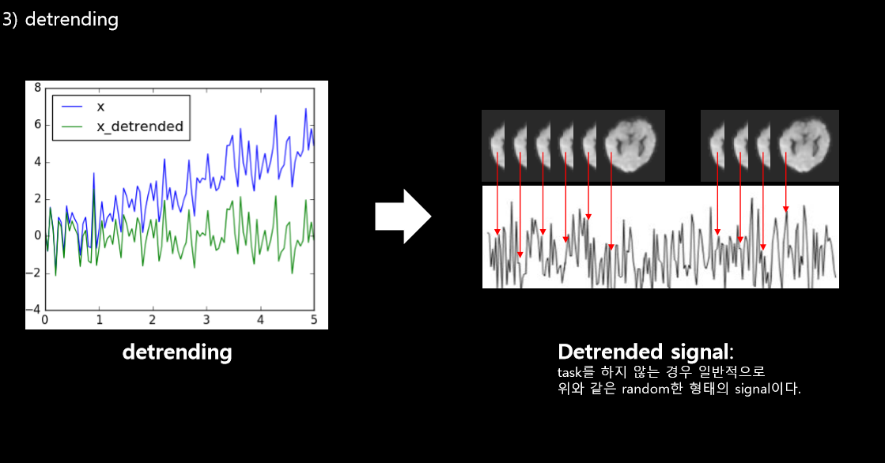
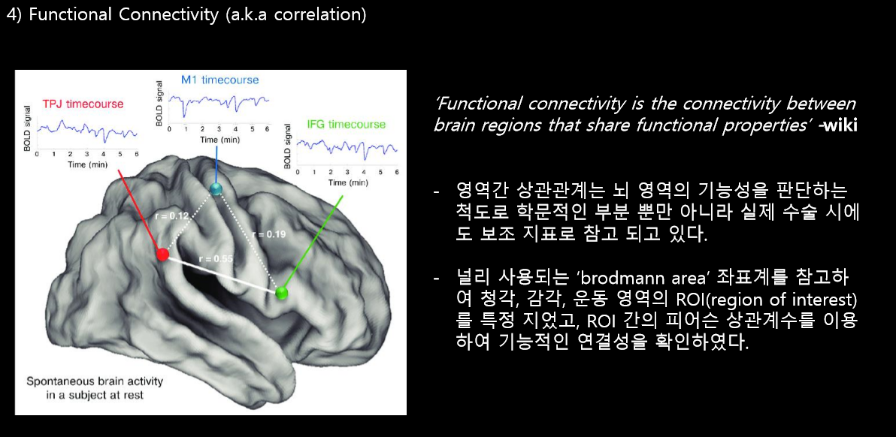
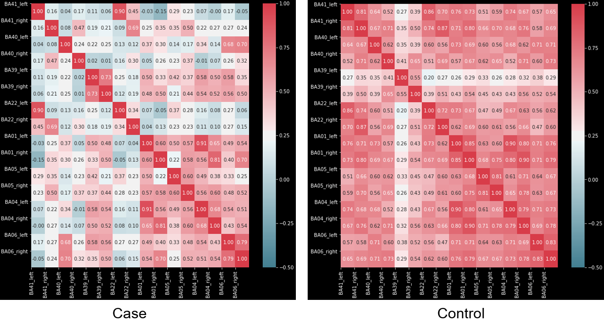

# cortical-deafness and functional connectivity
with KNUH

## description
경북대학교병원 재활의학과와의 협업으로 진행한 스터디로, fMRI데이터를 이용하여 대뇌피질 이상으로 발생한 'cortical-deafness' 환자의 뇌 영역간의 기능적 연결성을 분석하고 일반인과 비교한 연구.

## intro
청력 감퇴 및 청력 상실은 일반적으로 청각 기관의 구조적인 문제로 발생한다. 하지만 드물게도 청각기능을 담당하는 뇌 피질의 이상으로 청력 손상이 생기는데 이를 ‘cortical deafness’라 한 다. ‘cortical deafness’는 주로 뇌졸증이 발생한 환자들에게 발견되는데 뇌졸증으로 뇌경색 또는 뇌 출혈이 청각을 담당하는 영역에 직접적인 영향을 끼치는 경우 발견할 수 있다. 상기 환자의 경우 일반적인 ‘cortical deafness’가 아니라 좌우 반구에 각각 뇌졸증이 발병하여 양쪽 청각 영역이 모두 damage를 입어 양쪽 청각이 모두 감퇴한 특별한 경우이다

## data

MRI 영상 데이터를 사용하였다.
* fMRI data : 뇌의 기능영상. 2초에 한번씩 sampling 하여 8분 동안 총 240개의 sampling이 된 데이터이다. 데이터의 구조는 가로x세로x높이x시간 총 4차원 데이터
* T1 data : 뇌의 구조영상. 

## patient
환자는 39세의 환자이며, 양쪽 반구의 stroke으로 인해서 청각을 담당하는 영역이 손상을 입었다. 추가로, 손상입은 영역이 Cortical Spinal Tract(CST) 영역에도 손상을 가져다 주어 움직임 및 운동기능 감퇴도 보여준다.

## method
분석의 전반은 다음과 같다.  
1) 영상 데이터를 normalization 한다.
2) 움직임(Motion)으로 인한 효과 제거.

3) Detrending – 선형 trend 제거

4) 영역간 상관계수 비교 – 피어슨 상관계수

5) 환자 vs 일반인 비교

## result

환자의 경우 일반인보다 전반적인 영역의 연결성이 떨어져 있음을 보여준다. 뇌의 구조적인 영향이 기능에도 영향을 끼쳤다.
